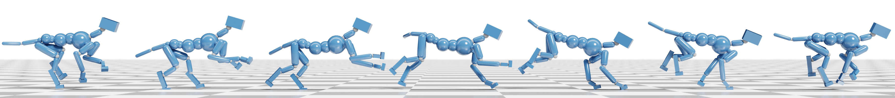

# Particle Filtering Policy Network (PFPN)

This code is to support the paper _**PFPN: Continuous Control of Physically Simulated Characters using Particle Filtering Policy Network**_. [[arXiv](https://arxiv.org/abs/2003.06959)]
[[Youtube](https://www.youtube.com/watch?v=YTtdnq0WpWo)]

This paper has been accepted by Motion, Interaction and Games (MIG '21).

_Abstract_ -- Data-driven methods for physics-based character control using reinforcement learning have been successfully applied to generate high-quality motions. However, existing approaches typically rely on Gaussian distributions to represent the action policy, which can prematurely commit to suboptimal actions when solving high-dimensional continuous control problems for highly-articulated characters. In this paper, to improve the learning performance of physics-based character controllers, we propose a framework that considers a particle-based action policy as a substitute for Gaussian policies. We exploit particle filtering to dynamically explore and discretize the action space, and track the posterior policy represented as a mixture distribution. The resulting policy can replace the unimodal Gaussian policy which has been the staple for character control problems, without changing the underlying model architecture of the reinforcement learning algorithm used to perform policy optimization. We demonstrate the applicability of our approach on various motion capture imitation tasks. Baselines using our particle-based policies achieve better imitation performance and speed of convergence as compared to corresponding implementations using Gaussians, and are more robust to external perturbations during character control.

Here we provide the implementation of DPPO and SAC using PFPN. 
We also provide our implementation of DeepMimic tasks using PyBullet library.

## Dependencies

    Tensorflow 1.14
    Tensorflow Probability 0.7
    OpenAI Gym
    Pybullet

All of those packages can be installed by

    pip install --user -r requirements.txt

## Usage
To reproduce the benchmark results shown in the paper by the following command:

    bash benchmark.sh ${environment} ${setting_file} ${#_of_particles} ${random_seed} --train

For example, to reproduce the benchmark results of `DeepMimicWalk` task with DPPO and 35 particles per action dimension can run

    bash benchmark.sh DeepMimicWalk-v0 deepmimic.deepmimic_dppo_pfpn 35 1 --train

To visualize the training result can run the above command without `--train` option, i.e.

    bash benchmark.sh DeepMimicWalk-v0 deepmimic.deepmimic_dppo_pfpn 35 1

All benchmark supported environments and the corresponding setting files are listed below.

| Environment                   | Setting File                                    | # of Particles |
|-------------------------------|-------------------------------------------------|----------------|
| DeepMimic{Walk/Punch/Kick}-v0 | deepmimic.deepmimic_{dppo/sac}_pfpn  | 35        |    
