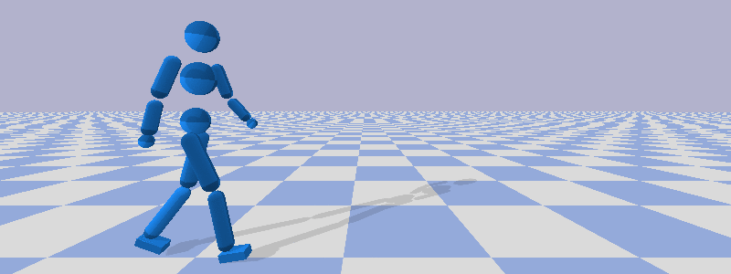

# Particle Filtering Policy Network (PFPN)
This code is to support the paper _**Adaptive Discretization for Continuous Control using Particle Filtering Policy Network**_. In the paper, we propose PFPN as a replacement of the policy network with Gaussian policies to solve continuous control problems by adaptively discretizing action spaces. This is a general framework to deep reinforcement learning using policy gradient method and can be easily applied on current widely used on-policy and off-policy policy gradient methods.

PFPN show its advantage in high-dimensional, continuous control tasks, compared to Guassian policies and the fixed, uniform discretization scheme (DISCRETE).

|PFPN-DPPO, 35 particles per action dimension | DISCRETE-DPPO, 200 atomic actions per dimension |
|---------------------------------------------|-------------------------------------------------|
| |  |

Here we provide the implementation of DPPO, A3C, IMPALA and SAC using PFPN. We also provide our implementation of DeepMimic tasks depending on Pybullet library through which the benchmark results shown in the paper can be reproduced.

## Dependencies

    Tensorflow 1.14
    Tensorflow Probability 0.7
    OpenAI Gym
    Pybullet

All of those packages can be installed by

    pip install --user -r requirements.txt

## Usage
To reproduce the benchmark results shown in the paper by the following command:

    bash benchmark.sh ${environment} ${setting_file} ${#_of_particles} ${random_seed} --train

Supported environments include Roboschool environments and our implemented DeepMimic tasks. All setting files are provided in `settings` folder.

For example, to reproduce the benchmark results of `DeepMimicWalk` task with DPPO and 35 particles per action dimension can run

    bash benchmark.sh DeepMimicWalk-v0 deepmimic.deepmimic_dppo_par 35 1 --train

The checkpoint file and log file will be stored at `ckpt_DeepMimicWalk-v0` and `log_DeepMimicWalk-v0` automatically. Use `--debug` option to show optimization information during training.

To visualize the training result can run the above command without `--train` option, i.e.

    bash benchmark.sh DeepMimicWalk-v0 deepmimic.deepmimic_dppo_par 35 1

All benchmark supported environments and the corresponding setting files are listed below.

| Environment                   | Setting File                                    | # of Particles |
|-------------------------------|-------------------------------------------------|----------------|
| ReacherBulletEnv-v0           | roboschool.roboschool_{ppo/a2c/impala/sac}_pfpn | 10             |
| HalfCheetahBulletEnv-v0       | roboschool.roboschool_{ppo/a2c/impala/sac}_pfpn | 10             |
| AntBulletEnv-v0               | roboschool.roboschool_{ppo/a2c/impala/sac}_pfpn | 10             |
| HumanoidBulletEnv-v0          | roboschool.roboschool_{dppo/a3c}_pfpn   roboschool.roboschool_impala_humanoid_pfpn   roboschool.roboschool_sac_async_pfpn        | 10             |
| DeepMimic{Walk/Punch/Kick}-v0 | deepmimic.deepmimic_{dppo/a3c/impala/sac_async}_pfpn | 35        |    
